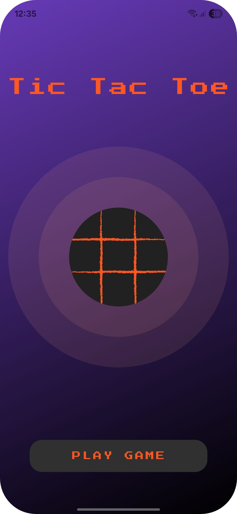
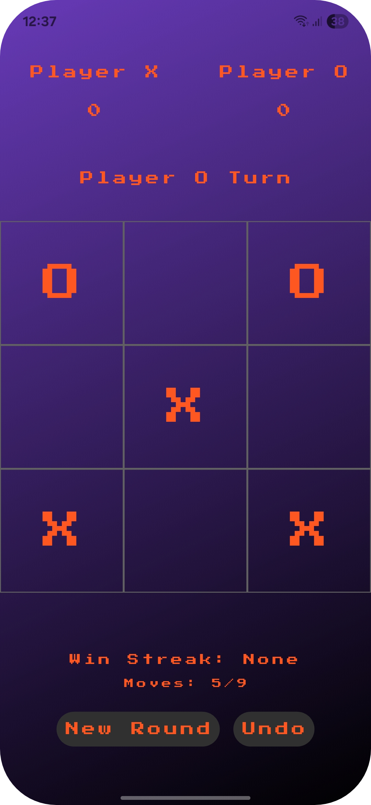
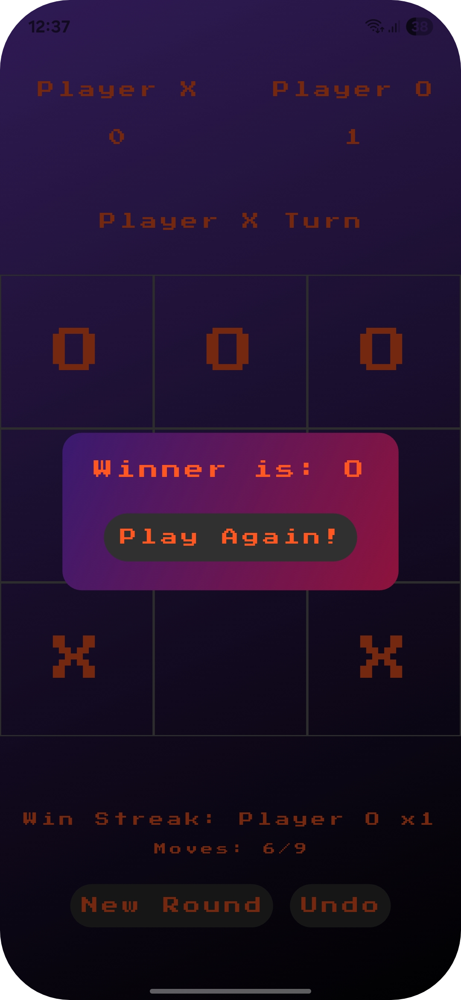

# Tic Tac Toe Game

A simple and clean Tic Tac Toe game built with Flutter.

## Features

- Two-player local gameplay (X and O)
- Turn indicator (shows whose turn it is)
- Winner detection (rows, columns, diagonals)
- Draw detection when all boxes are filled and no winner
- Scoreboard for both players
- Undo last move
- New round button
- Move counter (e.g. 4/9)
- Win streak tracker
- Intro screen with animated glow and Play button
- Custom retro style using PressStart2P font and gradient UI

## Screenshots

<p align="center">
   
   
   
</p>

## Getting Started

1. **Clone the repo**
	```bash
	git clone <repo-url>
	cd tictactoe_game
	```
2. **Install dependencies**
	```bash
	flutter pub get
	```
3. **Run the app**
	```bash
	flutter run
	```

## Project Structure

```text
lib/
├── main.dart       # App entry point
├── IntroPage.dart  # Intro screen and start button
└── HomePage.dart   # Game board, turns, score, streak, undo, and round logic
```
